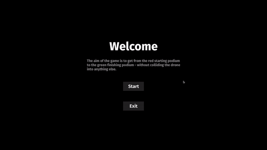

# drone_game

<p align="center">
  
</p>

A small game I'm making whilst I learn how to use Bevy. The aim of the game is to get the drone from the red to the green podium without colliding into anything else.

## Key-Mapping

The movement of the drone is mapped to WASD by default. W/S accelerates the drone up and down. A/D rotates the drone anti-clockwise and clockwise. If you would like to use a different layout, you can modify this in the "keymap.ron" file (found in the root directory of the game).

## Installation

See the releases section for pre-compiled versions of the game. If a precompiled version is not available for your platform, please follow the compilation instructions below.

## Compilation

This game can be compiled to run on Windows, Linux and macOS.

Firstly, a rustup installation is required. Instructions for installing this can be found at https://www.rust-lang.org/tools/install.

Depending on your platform, some other dependencies may need to be installed, which are detailed in this guide:
https://bevyengine.org/learn/book/getting-started/setup/

Once the above steps are completed, clone this repository and build+run using cargo:
```bash
git clone https://github.com/Sam-Bowden/drone_game
cd drone_game
cargo run --release
```
